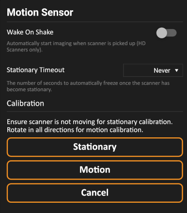
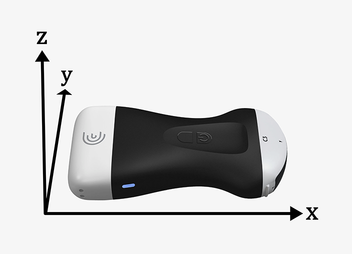

Interial Measurement Unit
=========================

This repository contains all related items for using the integrated 9-DOF inertial measurement unit (IMU) on Clarius devices.

Images, videos, and raw data will include IMU meta information when the sensor has been enabled. To enable, press the IMU icon from within the modes menu within the Clarius App.

Inertial data can be accessed by:
- Using the Cast API to stream images in real-time
- Accessing stored images, videos, and raw data from Clarius Cloud

The inertial data is sent or stored in text & binary formats, depending on the mode of acquisition, and includes:
- Linear acceleration (accelerometer)
- Angular velocity (gyroscope)
- Magnetic flux density (magnetometer)

All inertial data collected is rectified and oriented according to the calibration, units, and axes orientations mentioned below. 

## Calibration
If using the IMU for positional or motion tracking, ensure to calibrate the device on a semi-regular basis through the Motion Sensor calibration section in the Clarius App settings.

There are two calibration modes:
- Static calibration, where the probe must remain still on a flat surface
- Motion calibration, where the probe should be rotated across all axes for approximately 10 seconds

The static calibration corrects accelerometer gains and gyroscope offsets, while the motion calibration corrects soft and hard iron magnetometer distortions.

## Units
- Acceleration is normalized to gravity (m/s2) / (m/s2)
- Angular rate is provided in radian per second (rps)
- Magnetic flux density is provided in Gauss

## Axis Orientation
The IMU sensor data is aligned to the axes as shown below. This is consistent across all Clarius probe generations.

## Sensor Location
The physical sensor is offset from the centre of the imaging plane. The dimensions are model specific as shown in the tables below. First Generation and HD Clarius probes use a combined Accelerometer/Gyroscope/Magnetometer sensor, whereas the HD3 probes use separate Accelerometer/Gyroscope and Magnetometer sensors. All offsets are measured from the center of the imaging array and according to the axes displayed in the section above.

### First Generation Clarius
| Model   | X (mm)  | Y (mm)  | Z (mm)  |
| :----   | :-----  | :-----  | :-----  |
| C3      | -150    | 18      | -5.4    |
| C7      | -156    | 18      | -5.4    |
| L7      | -149    | 18      | -5.4    |

### Clarius HD
| Model   | X (mm)  | Y (mm)  | Z (mm)  |
| :----   | :-----  | :-----  | :-----  |
| HD_C3   | -114.55 | 2       | 6.11    |
| HD_C7   | -119.65 | 2       | 6.11    |
| HD_L7   | -114.69 | 2       | 6.11    |
| HD_L15  | -114.77 | 2       | 6.11    |
| HD_L20  | -114.33 | 2       | 6.11    |
| HD_PA   | -115.70 | 2       | 6.11    |
| HD_EC7  | -277.49 | 2       | 6.11    |

### Clarius HD3 Accelerometer/Gyroscope
| Model   | X (mm)  | Y (mm)  | Z (mm)  |
| :----   | :-----  | :-----  | :-----  |
| HD3_C3  | -107.72 | -7.2    | 6.54    |
| HD3_C7  | -112.14 | -7.2    | 6.54    |
| HD3_L7  | -107.86 | -7.2    | 6.54    |
| HD3_L15 | -107.93 | -7.2    | 6.54    |
| HD3_L20 | -107.50 | -7.2    | 6.54    |
| HD3_PA  | -108.86 | -7.2    | 6.54    |
| HD3_EC7 | -270.65 | -18.2   | 6.54    |

### Clarius HD3 Magnetometer
| Model   | X (mm)  | Y (mm)  | Z (mm)  |
| :----   | :-----  | :-----  | :-----  |
| HD3_C3  | -92.41  | -21.73  | 6.46    |
| HD3_C7  | -96.83  | -21.73  | 6.46    |
| HD3_L7  | -92.55  | -21.73  | 6.46    |
| HD3_L15 | -92.62  | -21.73  | 6.46    |
| HD3_L20 | -92.19  | -21.73  | 6.46    |
| HD3_PA  | -93.55  | -21.73  | 6.46    |
| HD3_EC7 | -255.34 | -32.73  | 6.46    |

## Data Collection

### Cast API

The Cast API allows images and inertial data to be collected in real-time. When a new image is received, a set of inertial data will be passed to the new image callback function. Several inertial measurements may be acquired for a single image, depending on the imaging frame rate. The ClariusPosInfo struct contains the inertial data for each measurement and contains 14 pieces of information:
- Data timestamp
- 3 gyroscope axes
- 3 accelerometer axes
- 3 magnetometer axes
- 1 real component of the orientation quaternion
- 3 imaginary components of the orientation quaternion

### Offline

Clarius Cloud is a convenient way to store and access images and data. Inertial information can be uploaded to Clarius Cloud after activating the sensor. Raw data can be downloaded from Clarius cloud in a compressed folder for offline analysis; the compressed file contains timestamp_imu.yml which contains the inertial measurements associated with the raw data and images collected.

Each entry in imu.yml file contains the same information as specified in the ClariusPosInfo structure for the Cast API.

## Components

The following IMU components are used in the various versions of Clarius devices:

- Gen 1 / Clarius HD
  - ST LSM9DS1
- Clarius HD3
  - ST LSM6DS0 (gyroscope / accelerometer)
  - ST LIS2MDL (magnetometer)
